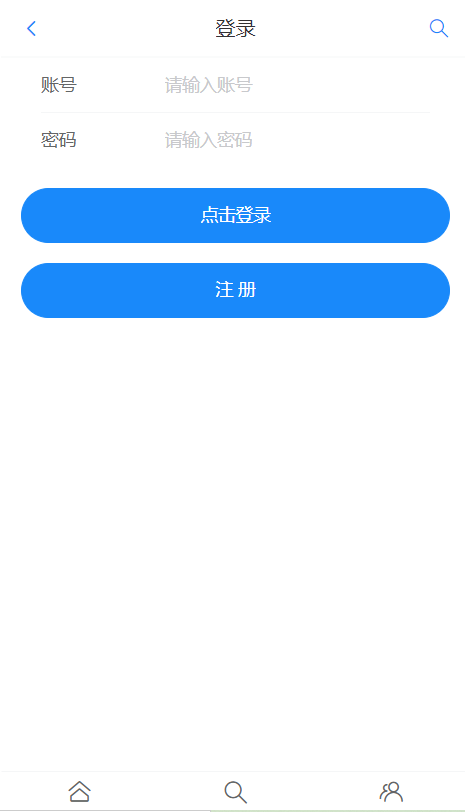
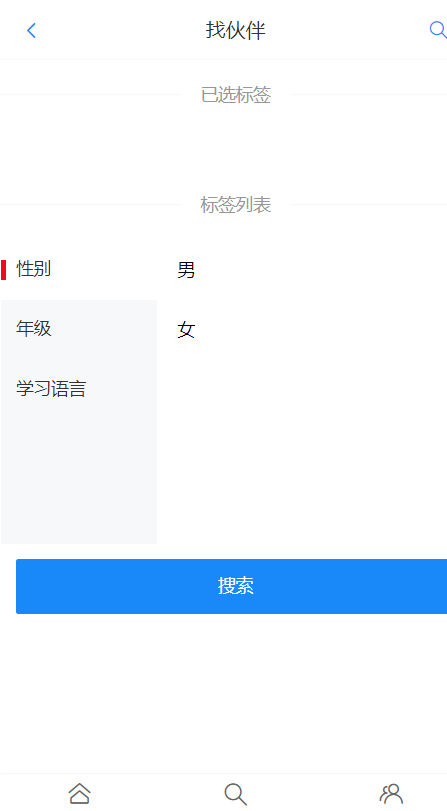
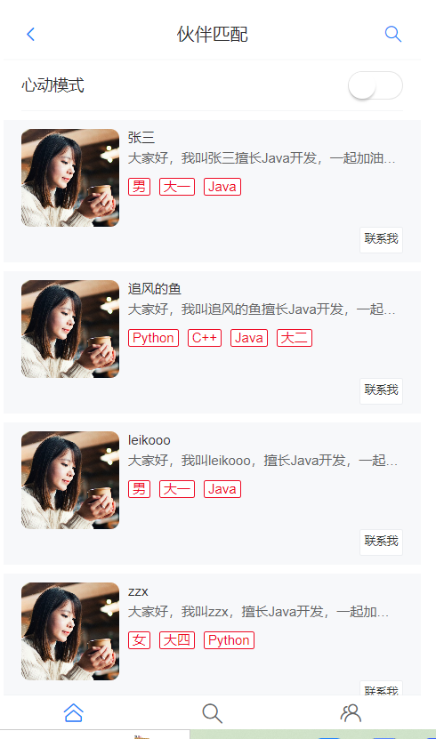
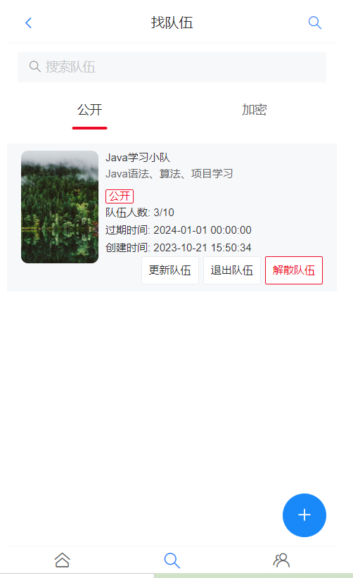
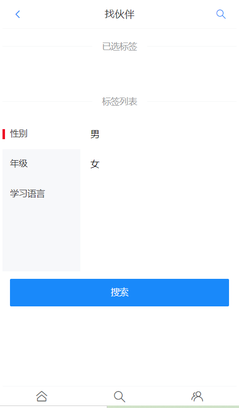
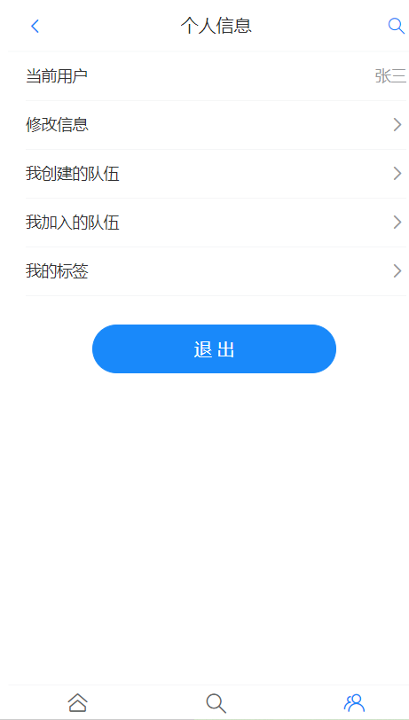

### 一、项目介绍
编程之友匹配系统，一个前后端分离的用户匹配系统，前端使用 Vue3 + Vant4 ，后端使用 SpringBoot + MyBatis-Plus + MySQL + Redis 等技术。实现了用户管理、按标签检索用户、推荐相似用户、组队等功能。 
### 二、在线体验
在线访问：http://101.42.24.244
可以自行注册账号
### 三、项目背景
许多热爱编程的校园同学以及社会朋友在参加编程比赛时常常面临没有队友的问题，这使得他们很难发挥自己的实力，也很难取得好成绩。同时，许多用户在寻找队友时也面临一些困难，比如无法找到合适的人选，或者无法与潜在的队友进行充分的交流和沟通。因此，我们希望通过该网站，为这些用户提供一个交流平台，帮助他们找到理想的队友，组建强大的竞赛团队，参加各种校园比赛，并最终实现自己的梦想。
### 四、核心功能

1. 用户注册和登录：用户可以注册账号并登录使用该网站。
2. 标签匹配：用户可以选择标签，系统会根据标签匹配合适的队友。
3. 心动模式：系统会自动去筛选与用户标签相似的用户展示出来。
4. 组队功能：用户可以与其他用户组建队伍，一起参加校园竞赛。支持公开和加密两种队伍类型。
5. 用户信息：用户可以修改自己的标签、昵称等信息。

### 五、项目亮点
1. 使用 Redis 实现分布式Session登录，解决集群间登录态同步问题。
2. 使用EasyExcel读取收集来的基础用户信息，并通过自定义线程池+CompletableFuture并发编程提高批量导入数据库的性能，实测导入10万行的时间从62秒缩短至17秒。 
3. 使用Redis缓存首页高频访问的用户信息表，将接口响应时长从1.62s缩短至150ms，速度变快了15倍。
4. 为解决首次访问系统的用户主页加载过慢问题，使用Spring Scheduler定时任务来实现缓存预热，并通过分布式锁保证多机部署时定时任务不会重复执行。 
5. 为解决同一用户重复加入队伍、入队人数超限问题，使用Redisson分布式锁来实现操作互斥，保证了接口幂等性。
6. 使用编辑距离算法实现了根据标签匹配最相似用户的功能，并根据相似度对用户列表进行了排序。
7. 对于项目中复杂的集合处理（比如为队伍列表关联已加入队伍的用户），使用 Java 8 Stream API 和 Lambda 表达式来简化编码。
8. 使用 Knife4j + Swagger 自动生成后端接口文档，避免了人工编写维护文档的麻烦。
9. 为了明确接口的返回，自定义统一的错误码，并封装了全局异常处理器，从而规范了异常返回、屏蔽了项目冗余的报错细节。
10. 对于项目中的JSON格式化处理对象，采用双检锁单例模式进行管理，从而复用对象，避免了重复创建对象的开销，便于集中维护管理。
### 六、技术选型
前端
- Vue3 + Vant4 UI 移动端组件库

后端
- SpringBoot + Mybatis + MyBatis-Plus 

后端组件
- Redisson + EasyExcel + Gson + Knife4j + Spring-session-data-redis 

中间件
- MySQL + Redis + Nginx
### 七、后端部署
1. 执行安装后端所需依赖：
`maven install`
2. 使用根路径下的/sql/create_table.sql创建数据库和对应的表。
3. 修改application-open.xml文件，将mysql和redis的地址改为自己数据库的地址。
### 八、功能介绍
 **登录/注册**
1. 已有账号可以直接进行登录，没有账号可以在登录页面点击注册。
2. 注册信息包括用户名、用户密码、用户昵称。 
3. 首次注册之后会进入引导页面首次添加自己的标签，可以直接跳过。

 **主页** 
1. 用户推荐：在主页会推荐显示一部分用户，显示的用户信息包括用户名称、用户标签、用户自我介绍。
2. 心动模式：开启心动模式会自动匹配标签相似的用户并根据相似度进行排序。

 **创建队伍** 
1. 在队伍页面点击右下角的加号可以跳转至创建队伍页面。
2. 创建队伍可以填写队伍名，队伍描述，过期时间，最大人数，队伍状态（公开/加密）。
3. 最大人数：最大人数填写限制最少为3个人。
4. 队伍状态：可以选择公开和加入两种状态，公开状态可以直接加入，加密状态输入正确密码之后才可以加入。

 **队伍页面信息显示** 
1. 在队伍页面可以根据队伍名称或队伍描述进行搜索队伍。
2. 队伍页面显示的队伍信息队伍信息会显示队伍名称、描述、状态、当前人数/总人数、过期时间。

 **用户搜索功能**
1. 点击右上角的搜索按钮可以进入用户搜索页面。
2. 可以选择标签来进行搜索用户。

 **个人中心**
1. 在个人中心可以查看个人信息、已创建/加入的队伍、自己的标签。
2. 在个人中心可以对个人信息修改，例如用户昵称、性别、手机号、自我介绍等。
3. 在个人中心可以修改自己的标签。
4. 在个人中心页面可以退出登录。
### 九、部分界面展示
 **1. 登录注册页面** 

 **2. 首次注册之后添加自己的标签，可以选择直接跳过** 

 **3. 首页** 

 **4. 队伍页面** 

 **5. 根据标签搜索用户** 

 **6. 个人中心** 

